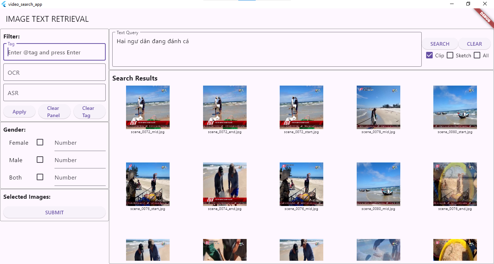

# Image Text Retrieval

An image search application based on textual features input by users through the UI.

Users can filter the JSON information stored in the database, which was previously automatically extracted from images through Object Detection, OCR, ASR, and CLIP.

The information includes audio information, text, people, objects, location, and image descriptions.

** Note: This project is still under development.

# Features:

**Image Text Retrieval System:**

- Utilizes CLIP (Contrastive Language-Image Pre-training) and BLIP (Bootstrapping Language-Image Pre-training) model for image-text matching. 
- Implements a Flask backend deployed on Kaggle. 
- Integrates with a Flutter frontend for user interaction. 

Search Functionality: 

- Text-based image search using natural language queries.
- Supports multiple search types: Clip, BLIP, or All.
- Translates Vietnamese queries to English for broader search capabilities.
- Filtering Options: Users can use OCR, ASR, or Tag information to filter the JSON information which was previously extracted from images and stored in the Database.

Filtering Options:
- Gender-based filtering (Female, Male, Both) with numerical inputs.
- OCR (Optical Character Recognition) text filtering.
- ASR (Automatic Speech Recognition) text filtering.
- TAG text filtering.

Backend Features: 

- FAISS (Facebook AI Similarity Search) for efficient similarity search.
- Pre-computed image embeddings for fast retrieval.
- Json data is stored and searched through ElasticSearch.
 
Frontend Features: 
- Responsive design using Flutter with cross-platform compatibility (iOS, Android, PC, Web)

# Demo Videos: 

[[Demo Video 1]](https://www.youtube.com/watch?v=piMn9Anx2FM)

